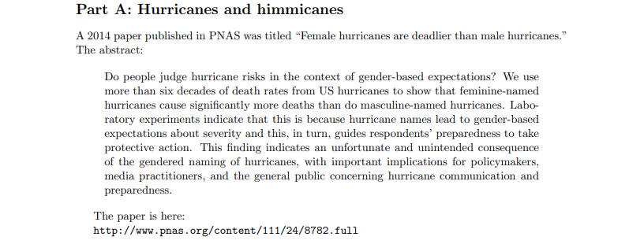
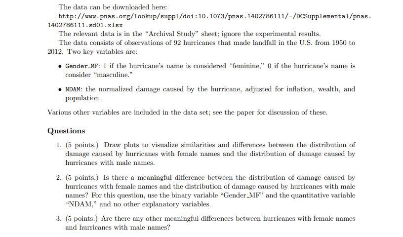
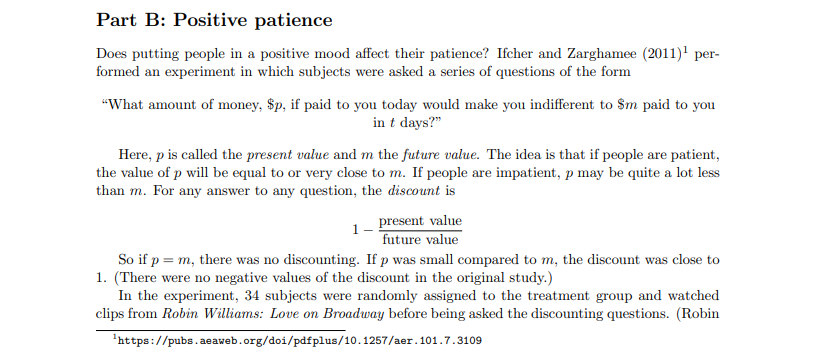
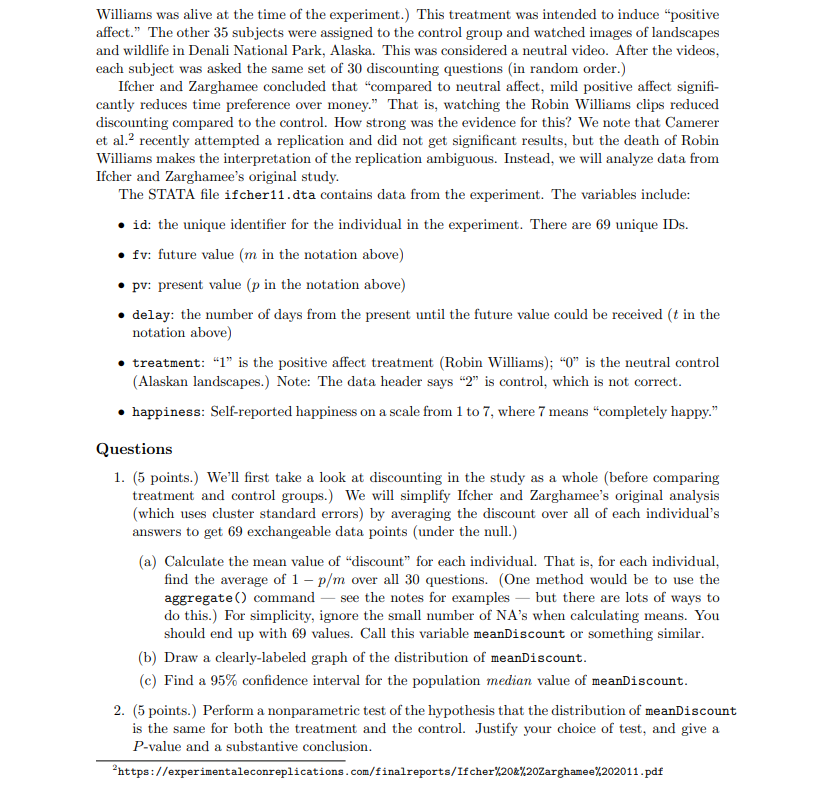
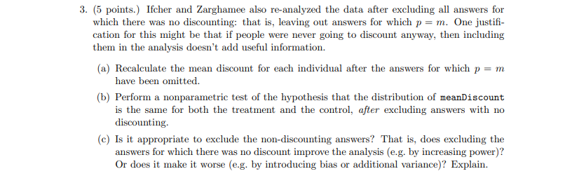
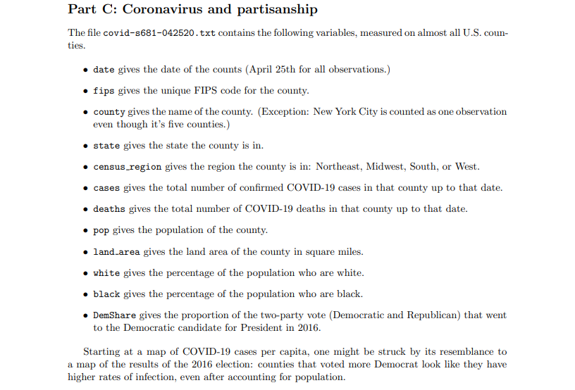
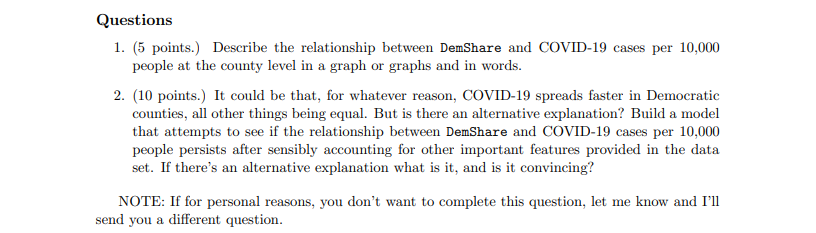

```{r, message=FALSE}
library(ggplot2)
library(tidyverse)
library(BSDA)
cbPalette <- c("#56B4E9", "#009E73", "#999999", "#E69F00", 
               "#F0E442", "#0072B2", "#D55E00", "#CC79A7")
```





# Part A: Hurricanes and himmicanes

We will first import our data into a dataframe so that we can analyze it. The data we are using comes from the archival study sheet in the xlsx file found on this page: https://www.pnas.org/content/suppl/2014/05/30/1402786111.DCSupplemental. For ease of import a csv file has been created that includes only this data.

```{r}
hurr <- read.csv("hurricane.csv", header = TRUE)
summary(hurr)
```

## What's in a name?

Before diving into the questions, let's just look at the distribution of female and male names.

```{r}
table(hurr$Gender_MF)
```

We see that we have more than twice as many female named hurricanes, but this study does include what it calls the masculinity-femininity index. This helps neutralize some of the issue where some names could be considered male or female names such as: Alex, Charley, and Danny. The method that this index was generated does not seem to be the best in my opinion. Nine people who were blind to the hypothesis rated the names on a basis of if they were masculine or feminine, 1 being masculine and 11 being feminine. 

As the study seeks to show how the name of the hurricane effects the damage caused and loss of life, it would seem that the masculinity of a name should be based on the overall consensus of people in the year the hurricane made landfall. For example, Danny might have been exclusively a male name in 1954; whereas now 66 years later, there are women who go by Danny. So evaluating the names on masculinity in the 2010s when this paper was written, might not give the best indication of how the names were perceived when the hurricanes made landfall. 

The only reason this explanation is given before answering the questions is because the data provided might give us an answer that could be misleading because the data itself was flawed. What is more, we will mostly be looking at the binary decision of if a name is feminine or masculine, when we know that in reality many names are not binary in this sense. 

## Data cleaning

Certain data cleaning might make it easier to visualize or analyze our data. Those changes will be done here.

First we will make a column that has the word "Female" or "Male" to describe the name of the hurricane instead of 1 or 0 respectively. This column will also be a factor.

```{r}
hurr$Gender <- as.factor(ifelse(hurr$Gender_MF == 1, "Female", "Male"))
summary(hurr$Gender)
```

## Question 1. 

We will first look at the difference in damage caused by hurricanes in the form of normalized damage in millions of dollars.

```{r}
ggplot(hurr, aes(x = NDAM)) + 
  geom_histogram(binwidth = 5000, fill = "blue", color = "black", alpha = 0.6) + 
  facet_wrap(~Gender) +
  xlab("Normalized Damage ($ Millions)") +
  labs(title = "Normalized Damage of Hurricanes between 1950 and 2012", 
       subtitle = "Based on Name of Hurricane")
```

We see that both male and female named hurricanes have right-skewed distributions with a majority of hurricanes causing \$25 billion or less in damage. Remember that we have twice as many female named hurricanes as male, so although there are larger counts in the female histogram, the overall distributions are rather similar. We can see that the most destructive female hurricane, in terms of dollars of damage, comes from a female hurricane. The main difference between the distributions is that female hurricanes have a single peak at the low end of the damage range, whereas male hurricanes have a peak at the low end of the damage spectrum, but a dip in hurricanes that caused \$10-\$20 billion in damage and then a small peak at \$20-\$25 billion dollars of normalized damage.

Perhaps a boxplot could further assert similarities in the distributions. As we have right-skewed data, a log transformation on the normalized damage can be done to look at the distribution of log normalized damage. 

```{r}
ggplot(hurr, aes(x = Gender, y = log(NDAM), fill = Gender)) + 
  geom_boxplot() +
  scale_fill_manual(values = cbPalette) +
  ylab("Log of Normalized Damage ($ Millions)") +
  labs(title = "Comparison of Distribution of Male and Female Hurricanes", 
       subtitle = "From 1954 to 2012") +
  theme(axis.text.x = element_blank())
```

When we look at the log of normalized damage, we see very similar distributions. Male hurricanes have a larger range and inter-quartile range, which suggests that there is a larger variance in the normalized damage caused by Male named hurricanes in comparison to female named hurricanes. Male hurricanes also have a slightly higher median log normalized damage. With all that said, the third quartile and max is almost equal. This suggests that both female and male named hurricanes in our data had similar potential when it comes to log normalized damage. 

While economic damage is an important factor, loss of life is another measure of damage produced by a hurricane. We can look at the difference in distribution of deaths between male and female hurricanes.

```{r}
ggplot(hurr, aes(x = alldeaths)) + 
  geom_histogram(binwidth = 10, fill = "blue", color = "black", alpha = 0.6) + 
  facet_wrap(~Gender) +
  xlab("Number of Deaths") +
  labs(title = "Deaths Attributed to Hurricanes between 1950 and 2012", 
       subtitle = "Based on Name of Hurricane")
```

As expected, we see another right skewed distribution for both male and female named hurricanes. Interestingly we see that none of the male hurricanes caused more than 100 deaths, whereas four female hurricanes killed more than 100 people. While there we don't have a huge number of data points, we do see something similar in both groups of hurricanes, there seems to be two peaks in the amount of deaths, the first peak being in the 0-10 deaths range and the second small peak being around 50 deaths. This could suggest that hurricanes are most likely not going to cause many deaths, but there is a subset of strong hurricanes that are more deadly. Then you have some outliers from especially strong hurricanes.

## Question 2. 

We know that the distribution of our data is not normal, and probably isn't drawn from a normal distribution based on our EDA so far. To determine if the distributions between male and female hurricane's damage, we can use a non-parametric test. The Wilcoxon Rank-Sum test could provide us with some evidence that the two distributions are different. The Wilcoxon rank-sum test is good test here as we do have some outliers and this test is less skewed by outliers as it uses ranks of each measure instead of the value of the variable in question. We will also do a two sided test as we just want to see if there is a difference and are not concerned with what direction the difference is in.

```{r}
library(coin)
wilcox_test(hurr$NDAM ~ hurr$Gender, dist = "exact")
```

We get a P-Value that is high by any standard which indicates that we fail to reject the null hypothesis that there is no difference between the groups. This is some evidence that there really isn't any difference between the hurricanes that are labeled female compared to the hurricanes labeled male when it comes to normalized damage. 

Let's take a look at the density plots. 

```{r}
ggplot(hurr, aes(x = NDAM, group = Gender, color = Gender)) + 
  geom_density() + 
  xlab("Normalized Damage ($ Million)") +
  labs(title = "Density of Normalized Damage from Hurricanes", 
       subtitle = "From 1954 to 2012")
```

It seems like the distributions are similar when plotted on top of each other, but do not seem like one is a shift of another. With that said, the distributions look similar enough to each other that we could look to see if one statistically is just a shift in mean when compared to the other.

```{r}
wilcox_test(hurr$NDAM ~ hurr$Gender, dist = "exact", conf.int = TRUE)
```

Our confidence interval for the true mu of these distributions is (-1950, 1140). We see that a 95% confidence interval for the shift parameter between the distributions encapsulates 0. As this confidence interval crosses 0, it gives evidence that we are not really sure if one distribution really is a shift one way or the other from each other. This gives more evidence to the fact that the distributions of normalized damage are exchangeable and not statistically different from one another. 

As we might be looking for more evidence that the models are not different, we can look at the Hodges-Lehmann estimate of the shift parameter.

```{r}
NDAM.m <- hurr$NDAM[which(hurr$Gender == "Male")]
NDAM.f <- hurr$NDAM[which(hurr$Gender == "Female")]
median(outer(NDAM.m, NDAM.f, '-'))
```

While the Hodges-Lehmann estimate is not equal to 0, the shift is rather small in comparison to the size of many of the normalized damage numbers. As this shift seems insignificant in the grand scheme of the overall normalized damage amounts, it would lead me to believe that the two distributions aren't really a shift of one another and the fact that the Hogdes-Lehmann estimate isn't equal to zero is just due to random variances between the two distributions.

In conclusion, when only using a hurricanes name's gender to explain normalized damage, we see that there really is no meaningful statistical difference between the two distributions.

## Question 3. 

When it comes to the data we are given, we have the following other variables we can look at to see if there is a difference between female and male named hurricanes: min pressure before, and category.

We can first analyze the minimum barometric pressure from before the hurricanes. Usually the lower the pressure, the stronger a hurricanes winds are. While precipitation amount does effect the destructive power of a hurricane, the wind speeds also account for a lot of the destructive power of a hurricane. 

There are two columns for the minimum barometric pressure before a hurricane, one is an adjusted number from 2014 probably based on new data. We will examine the adjusted numbers, so this means looking at the column named "Minpressure_Updated 2014"

Let's look at the density plots of the hurricanes in our dataset.

```{r}
ggplot(hurr, aes(x = Minpressure_Updated.2014, color = Gender, group = Gender)) + 
  geom_density() + 
  xlab("Pressure (millibars)") +
  labs(title = "Density Plot of Barometric Pressure Before Hurricanes",
       subtitle = "From 1954 to 2012")
```

We see similar density plots between male and female hurricanes. The only difference seems to be that male named hurricanes have a slightly larger spread of barometric pressures which results in slightly less density at each pressure. 

Again we could use a Wilcoxon rank-sum test to see if there is a difference in the barometric pressure distributions between male and female named hurricanes.

We can also just start with looking at the two means.

```{r}
pres.m <- hurr$Minpressure_Updated.2014[which(hurr$Gender == "Male")]
pres.f <- hurr$Minpressure_Updated.2014[which(hurr$Gender == "Female")]
```

```{r}
mean(pres.m)
```

```{r}
mean(pres.f)
```

The means are very similar between the two groups.

```{r}
wilcox_test(hurr$Minpressure_Updated.2014 ~ hurr$Gender, dist = "exact", conf.int = TRUE)
```

Based on the Wilcoxon rank-sum test, we get a large P-Value of about 0.68, which suggests that the two distributions are not statistically different. Also the confidence interval encapsulates 0 which also gives more evidence that there is no statistical shift between male and female named hurricanes when it comes to barometric pressure. 

Next we can look at the category of the storm. Generally there is a correlation between the category of the storm and the barometric pressure as the category is based on windspeeds. If there is no difference between the barometric pressures of the two distributions it is likely that the category is not going to be different, but we should still do tests.

```{r}
cor(hurr$Minpressure_Updated.2014, hurr$Category)
```

As we can see there is a strong negative correlation as suggested, the lower the barometric pressure the higher the storms category will likely be. 

Let's take a quick look at the density plot of the two distributions.

```{r}
ggplot(hurr, aes(x = Category, color = Gender, group = Gender)) + 
  geom_density() + 
  xlab("Category") +
  labs(title = "Density Plot of Category of Hurricanes", subtitle = "From 1954 to 2012")
```

The shapes of the two distributions is slightly different. We see that there is a peak at category 3 for female named hurricanes where we don't really see as strong of a peak at category 3 for males. This could prove to be a slight difference between male and female named hurricanes. 

Just to be safe, we can do a Wilcoxon rank-sum test on the category of the storm.

```{r}
wilcox_test(hurr$Category ~ hurr$Gender, dist = "exact")
```

Again, we get a large P-Value which suggests that the distribution of categories is not statistically different between male and female named hurricanes. Although there does seem to be a higher density of category 3 hurricanes that have female names then male.

One thing we could do is try to fit a model that includes our predictor variables, basically we are left with the category of the storm and the barometric pressure. We can predict these models and see if the predictions are different for male and female named hurricanes.

```{r}
ggplot(hurr, aes(x = Category, y = log(NDAM))) + 
  geom_point() +
  geom_smooth(method = "lm", se = FALSE, formula = y ~ x) + 
  ylab("Log of Normalized Damage") + 
  labs(title = "Normalized Damage by Category of Hurricane", subtitle = "From 1954-2012")
```

As an initial test, we see that log damage doesn't really follow a linear pattern when using category. This suggests we should use something like a gam for a predictive model.

```{r}
library(mgcv)
hurr.gam <- gam(log(NDAM) ~ s(Minpressure_Updated.2014, Category), data = hurr)
```

Now that we have a predictive model, lets see what the predictions are based on our original data.

```{r}
hurr$preddam <- predict(hurr.gam, newdata = hurr)
```

Now we can plot our predictions in relation to our two predictive variables.

```{r}
ggplot(hurr, aes(x = Minpressure_Updated.2014, y = log(NDAM), group = Gender, color = Gender)) + 
  geom_point() + 
  geom_line(aes(x = Minpressure_Updated.2014, y = preddam), data = hurr) +
  xlab("Barometric Pressure (millibars)") +
  ylab("Normalized Damage (log($ millions))") + 
  labs(title = "Normalized Damage from Hurricanes between 1954 and 2012") + 
  scale_color_manual(values = c("black", "red"))
```

We see that the splines are basically completely overlapping, as far as our predictive model is concerned, there really is no difference in male and female named hurricanes when it comes to barometric pressure predicting log normalized damage. Let's see if there is any difference when it comes to category.

```{r}
ggplot(hurr, aes(x = Category, y = log(NDAM), group = Gender, color = Gender)) + 
  geom_point() + 
  geom_line(aes(x = Category, y = preddam), data = hurr) +
  xlab("Category") +
  ylab("Normalized Damage (log($ millions))") + 
  labs(title = "Normalized Damage from Hurricanes between 1954 and 2012") + 
  scale_color_manual(values = c("black", "red"))
```

We do see some slight differences when it comes to category of storm. There really isn't a meaningful different. You could mabye say that for category 1 and 2 that female named hurricanes are predicted to cause more log damage. For categories 4 and 5, there really isn't much data so the right tail of the predictions are pretty dependent on those few datapoints and aren't as reliable. 

Really we do not see much of a difference between male and female named hurricanes when looking at a model that predicts damage from barometric pressure and storm category.

The last difference we can identify is the total count of hurricanes with female names compared to hurricanes with male names over the same time period (1954-2012). There are twice as many female named hurricanes than male, this alone could effect different measures done to compare the two. Overall though it seems that for the most part there is no major differences between female named hurricanes and male when using the binary male or female marker.





# Part B: Positive Patience

We will start by importing the data.

```{r}
library(haven)
pos <- read_dta(file = "ifcher11.dta")
head(pos)
```

## Question 1.

### Part (a)

We will start by creating a new column that includes the discount for each question, so that we can aggregate the discount.

```{r}
pos$discount <- 1 - (pos$pv/pos$fv)
head(pos)
```

Now we will aggregate the data to find the mean discount for each individual. When we aggregate, we can also take the mean of various other columns to be able to keep some of the variables with the data. In many cases these extra columns are all the same for each question. We will then save just the two columns we care about to it's own variable: mean discount, and treatment.

```{r}
pos.agg <- aggregate(pos, by = list(pos$id), FUN = mean, na.rm = TRUE)
meanDiscount <- pos.agg %>% select(treatment, discount)
head(meanDiscount)

aggregate(pos, by = list(pos$id), FUN = mean, na.rm = TRUE) %>% 
   select(treatment, discount) %>%
   head()
```

### Part (b)

We can use a density plot in ggplot to see the distribution of the mean discount of each participant in the study.

```{r}
ggplot(meanDiscount, aes(x = discount)) +
  geom_histogram(bins = 25, fill = "blue", color = "black", alpha = 0.6) + 
  xlab("Discount") +
  labs(title = "Mean Discount of Applicant Responses")
```

The histogram plot shows that the distribution of the mean discount is a right skewed distribution.

### Part (c)

We can start by finding the median of our mean discount as a point of reference. 

```{r}
median(meanDiscount$discount)
est <- numeric(9999)
```

To find a confidence interval we first must find a value of k such that the probability that the confidence interval does not contain the true population mean is no more than 5%. We can do this using a vector of different values of k and using pbinom. 

```{r}
k = c(25, 26, 27, 28, 29)
1 - 2 * pbinom(k - 1, 69, 0.5)
```

We see that the value of k that gives us a value that is at least 0.95 is 26. We can sort the values in mean discount and then move 26 spaces from each endpoint, these will be our endpoints of our confidence interval.

```{r}
meanDiscount.sort <- meanDiscount[order(meanDiscount$discount), 2]
```

```{r}
meanDiscount.sort[26]
```

```{r}
meanDiscount.sort[69 - 26 + 1]
```

This gives us a 95% confidence interval of about [0.051, 0.161] for the population median of the mean discount from all respondents.

Just as a final test we can use the sign test in the package BSDA to see if it gives us the same confidence interval as it uses a similar process.

```{r}
SIGN.test(meanDiscount$discount, md = 0.1)
```

We see that the sign test library also gives us a confidence interval of about [0.051, 0.161].

## Question 2.

We want to choose a non-parametric test to see if the distributions are statistically similar between the control and test. Right away we can see that we want some sort of permutation test. Before choosing a test and doing it, let's first look at the distributions plotted on the same plot to see what that looks like.

```{r}
meanDiscount$treatment <- recode_factor(meanDiscount$treatment, 
                                        '0' = "Control", '1' = "Test")
ggplot(meanDiscount, aes(x = discount, color = treatment, group = treatment)) +
  geom_density() + 
  xlab("Discount") + 
  labs(title = "Density of Mean Discount of Respondents in Positive Patience Study")
```

```{r}
ggplot(meanDiscount, aes(x = discount, color = treatment, group = treatment)) +
  geom_boxplot() + 
  xlab("Discount") + 
  labs(title = "Density of Mean Discount of Respondents in Positive Patience Study") + 
  theme(axis.text.y = element_blank())
```


We see from the density plot that the two groups seem to have somewhat differing shapes to their distributions. Although the shape is different, both still have the greatest density around a discount of 0.05. 

The test that we will use to determine if the two distributions are the same is the Wilcoxon rank-sum test. This is a permutation test in which the response variable, discount, is shuffled and then a mean is computed for the two groups. This is done many times and we see if over all those scrambles of the response variable produced meaningful differences in means of the two groups. In this case we want to do a two tailed test as we don't really care which way the shift goes, we just care if there is a substantial difference in the distributions.

The Wilcoxon rank-sum test is chosen here because we do not have data that seems like it is pulled from a specific distribution, and measuring the difference in means does make sense as we are looking at the mean of each respondents discount. We have an outlier that could effect our results, but the outlier is not particularly egregious. 

```{r}
wilcox_test(discount ~ treatment, dist = "exact", conf.int = TRUE, data = meanDiscount)
```

For this test we get a P-Value of about 0.1515, we also get a confidence interval that encapsulates 0. This confidence interval should be taken with a grain of salt though. We didn't really see any reason to believe that the treatment groups distribution could be explained by a shift of the control group in the density plot. 

This P-value sits squarely in a position where it is hard to evaluate it's significance. While by some standards a P-Value of about 0.15 is high, it really isn't extremely high or low. Our sample sizes aren't very large at 34 and 35 for the test and control group respectively. With these sizes, we run the risk of not really having enough power in the test which makes it hard for us to reject the null even if the populations actually are different. 

With all that said, we should fail to reject the null hypothesis that the distributions are the same, but with the caveat that our power is likely not too great so there is a decent chance of making a Type II error. As in many cases in statistics it would definitely be helpful to get a larger sample size so that we could increase our power and be able to reject the null if in fact the alternative is true.

## Question 3.

### Part (a)

We need to go back to our original data and subset it to only choose instances where the respondents in the study have a present value that does not equal the future value. 

```{r}
pos.neq <- subset(pos, pv != fv)
length(pos$id) - length(pos.neq$id)
```

We can see that this removes about 600 answers to questions, and the total length of the original data was about 2000 so we removed around 25% of our data. Now we can reaggregate the data. 

```{r}
pos.agg.neq <- aggregate(pos.neq, by = list(pos.neq$id), FUN = mean, na.rm = TRUE)
meanDiscount.neq <- pos.agg.neq %>% select(treatment, discount)
head(meanDiscount.neq)
```

Let's look at some plots to see how the distributions changed by removing instances where the discount was 0.

```{r}
meanDiscount.neq$treatment <- recode_factor(meanDiscount.neq$treatment, 
                                            '0' = "Control", '1' = "Test")
ggplot(meanDiscount.neq, aes(x = discount, color = treatment, group = treatment)) +
  geom_density() + 
  xlab("Discount") + 
  labs(title = "Density of Mean Discount of Respondents in Positive Patience Study", 
       subtitle = "Instances of 0 Discount Removed")
```

```{r}
ggplot(meanDiscount.neq, aes(x = discount, color = treatment, group = treatment)) +
  geom_boxplot() + 
  xlab("Discount") + 
  labs(title = "Density of Mean Discount of Respondents in Positive Patience Study", 
       subtitle = "Instances of 0 Discount Removed") + 
  theme(axis.text.y = element_blank())
```

Removing the 0 discounts from the data did make a rather substantial change in the distributions in comparison of leaving them in. We also see that our outlier that we had in the control group is not an outlier. 

### Part (b)

For consistency, and for the same reasons, we will be using the Wilcoxon rank-sum test on the subset of our data.

```{r}
wilcox_test(discount ~ treatment, dist = "exact", conf.int = TRUE, data = meanDiscount.neq)
```

With our subset of our data that doesn't include discounts of 0, we get a P-value that is significant. With a P-Value of 0.05 we can reject the null in favor of the alternative hypothesis that the distributions are different. While in this case we did find that the distributions are different between control and treatment are different, see the discussion in the next part to see if this really means that this method provides principled and significant evidence or not.

### Part (c)

To decide if it is appropriate to exclude the non-discounting answers, we need to understand if it is done for a principled reason. I would lean on the side of saying that it is not appropriate in terms of a study. The idea of the study is to determine if mood influences patience, I believe that in cases where the discount is 0 still demonstrates whether the persons mood effects patience. If a person is willing to not discount the payment even after waiting that says something about their patience and then their mood could be evaluated to see if that had an effect on their patience. If there is no significance between mood and patience, then maybe patience when it comes to monetary compensation is based on some other variable.

We can look at how many participants were removed entirely because they had a 0 discount.

```{r}
length(pos.agg$id)
```

```{r}
length(pos.agg.neq$id)
```

We see that 11 participants were not included in the second analysis. This leads us to wonder why they didn't want a discount to begin with. Maybe the amount of money was so insignificant that any small change to it was not really going to impact them. For example someone who is financially secure might not see much difference between being given $20 instead of $25, whereas someone living paycheck to paycheck would see the extra $5 as something meaningful. 

```{r}
paste("Control Variance with 0s:", var(pos.agg$discount[which(pos.agg$treatment == 0)]))
paste("Treatment Variance with 0s:", var(pos.agg$discount[which(pos.agg$treatment == 1)]))
paste("Control Variance without 0s:", var(pos.agg.neq$discount[which(pos.agg.neq$treatment == 0)]))
paste("Treatment Variance without 0s:", var(pos.agg.neq$discount[which(pos.agg.neq$treatment == 1)]))
```


By reducing the sample size we are likely to decrease our power, meaning that it would take a larger difference in distributions to find significant findings. We see that in this case we did reject the null and our concern would be Type I error, but we should have a good reason to reduce the power and I do not believe that this is a principled reason to do so. By removing the 11 participants that all had a discount of 0 we would increase our variance in both groups. 

In the end I do not believe that excluding non-discounting answers is appropriate in terms of the overall study. It seems as though we would be removing answers from the study that just didn't meet our expectations that somehow patience could be measured monetarily for all respondents in this way. If Ifcher and Zarghamee saw people responding with a 0 discount as an issue prior to running the experiment, they should have constructed the study in such a way that this is avoided. As they did not construct the study in such a way, they opened them up to having people who would not care enough about the money to want a discount, and therefore should include all results.




# Part C: Coronavirus and partisanship

We will start by importing the coronavirus data and saving it to a variable.

```{r}
corona <- read.table("covid-s681-042520.txt", header = TRUE)
head(corona)
```

## Question 1.

Before any graphing or analysis, we should create a column that looks at the COVID-19 cases per 10,000 people.

```{r}
corona$case.bypop <- corona$cases / (corona$pop / 10000)
head(corona)
```

There are some rows where we do not have some data so that causes us to not have data for the coronavirus cases by population. For now we will ignore those datapoints.

```{r}
corona <- subset(corona, !is.na(corona$case.bypop))
```

We will start by creating a map of the US by county that shows coronavirus cases per 10,000 residents.

```{r}
## devtools::install_github("UrbanInstitute/urbnmapr")

library(tidyverse)
library(urbnmapr)
library(viridis)

data(counties)
counties$county_fips <- as.numeric(counties$county_fips)
corona_data <- left_join(corona, counties, by = c("fips" = "county_fips")) 

p1 <- corona_data %>%
  ggplot(aes(long, lat, group = group, fill = log(case.bypop))) +
  geom_polygon(color = NA) +
  coord_map(projection = "albers", lat0 = 39, lat1 = 45) +
  labs(title = "COVID-19 Cases by County", 
       subtitle = "Scale is Log of Cases per 10,000 as of April 25, 2020") + 
  scale_fill_viridis(option="magma") + 
  theme(legend.title = element_blank(),
        axis.title = element_blank(),
        axis.text = element_blank(),
        axis.ticks = element_blank(),
        panel.background = element_blank())
p1
```

```{r}
p2 <- corona_data %>%
  ggplot(aes(long, lat, group = group, fill = DemShare)) +
  geom_polygon(color = NA) +
  coord_map(projection = "albers", lat0 = 39, lat1 = 45) +
  labs(title = "Proportion of Two-Party Vote that Went to Democratic Candidate", 
       subtitle = "Taken from Results of 2016 Election") + 
  scale_fill_viridis(option="cividis") + 
  theme(legend.title = element_blank(),
        axis.title = element_blank(),
        axis.text = element_blank(),
        axis.ticks = element_blank(),
        panel.background = element_blank())
p2
```

When looking at these two plots of the US map, there definitely are some striking similarities between infection rates and counties political leanings. This is especially true when focusing on the coasts.

We can plot each county by it's democratic leanings compared to the COVID-19 cases per 10,000. As we know that there are places in the United States that there are vastly more infections than other places we should do a log transformation to make our plot show the distribution best. 

```{r}
ggplot(corona, aes(x = DemShare, y = log(case.bypop))) + 
  geom_point() + 
  xlab("Proportion of Vote") +
  ylab("Log Cases per 10,000 People") +
  labs(title = "COVID-19 Cases by County Compared to Proportion of Democratic Vote", 
       subtitle = "As of April 25, 2020") 
```

There does seem to be some level of positive correlation between the log of COVID-19 cases and Democratic vote. This means that it seems like as the proportion of democratic votes increases, so too does the log of cases of COVID-19 per 10,000 people. The correlation doesn't seem to be terribly strong.

```{r}
cor(corona$case.bypop, corona$DemShare)
```

As believed there is a rather weak correlation between the two variables. With that said, we have a great number of counties (~2800), so a dispersion such as this is probable even if there is some correlation between the two variables. 

## Question 2. 

As we look at building a model, let's look at the variables we have available to us to predict the cases of COVID-19 per 10,000 county residents.

```{r}
summary(corona)
```

The first variable that makes sense as a possible predictor is census_region. We could maybe use state, but there are so many that the geographical region as a factor is likely better. It seems plausible that climate and culture could effect transmission rate, and we know the various regions of the Us have varying climates and cultures. We can start by plotting these variables together. 

```{r}
corona$census_region = as.factor(corona$census_region)
ggplot(corona, aes(x = census_region, y = log(case.bypop))) + 
  geom_jitter() + 
  xlab("Region") + 
  ylab("Log of Cases per 10,000 People") + 
  labs(title = "COVID-19 Cases Per Capita by Geographical Region", 
       subtitle = "As of April 25, 2020")
```


There does seem to be some level of difference between geographical regions, we see that the Northeast as a whole seems to have higher rates per capita than other regions. This seems like it could be helpful in our model and we will include it for now.

Let's look at some plots to see how DemShare relates to the region.

```{r}
ggplot(corona, aes(x = census_region, y = DemShare)) + 
  geom_jitter() + 
  xlab("Region") + 
  ylab("Percent") + 
  labs(title = "Democratic Vote Share by Geographical Region")
```

When compared to the jitter plot of COVID-19 cases per 10,000 people this plot looks extremely similar. The bulk of the Northeast counties are higher on average than the South and Midwest, and the West is pretty evenly dispersed.

The next variable we can look at is population and area of the county. It probably doesn't make sense to use these variables on their own, but instead make a variable that is the population density. We know that viruses tend to spread more readily when people live closer together so population density seems like a plausible predictor for per capita cases of COVID-19. Population density is another variable that we will need to do some type of transformation on as there are some counties that are largely different than others.

```{r}
corona$popdensity <- corona$pop / corona$land_area
ggplot(corona, aes(x = log(popdensity), y = log(case.bypop))) + 
  geom_point() + 
  xlab("Log of Population Density (people/sq.mi.)") + 
  ylab("Log of Cases per 10,000 People") + 
  labs(title = "COVID-19 Cases Per Capita by Population Density", 
       subtitle = "As of April 25, 2020")
```

We see that there does seem to be some level of positive correlation between log of population density and log of per capita cases of COVID-19. 

```{r}
ggplot(corona, aes(x = log(popdensity), y = DemShare)) + 
  geom_point() + 
  xlab("Log of Population Density (people/sq.mi.)") + 
  ylab("Percent") + 
  labs(title = "Democratic Share by Population Density")
```

Again we see an extremely similar plot when looking at DemShare and population density. We would expect something like this as generally cities tend to be more democratic leaning.

The last two variables we could use as predictors are percentage of the counties population that are white and black. While no obvious reasons for why these variables might be good predictors for COVID-19 transmission are readily apparent to me, it's best to see what kind of relationship the two have.

```{r}
ggplot(corona, aes(x = white, y = log(case.bypop))) +
  geom_point() +
  xlab("Percentage of Population") +
  ylab("Log of Cases per 10,000 People") + 
  labs(title = "Percentage of County Population that are White")
```

Interestingly enough there does seem like there could be some level of correlation between the percentage of the population which is white and log of per capita cases of COVID-19. The relationship almost looks quadratic, but it is hard to be certain because there are so few points less than 50% compared to points greater than 50%.

```{r}
ggplot(corona, aes(x = white, y = DemShare)) +
  geom_point() +
  xlab("Percentage of Population that is White") +
  ylab("Percentage of Democratic Voters") + 
  labs(title = "Percentage of County Population that are White")
```

When looking at DemShare compared to percentage of white voters, the plot isn't perfectly the same as COVID-19 cases per 10,000 people but there definitely are similarities.

Lastly we can look at percentage of the population of counties that are black.

```{r}
ggplot(corona, aes(x = black, y = log(case.bypop))) +
  geom_point() +
  xlab("Percentage of Population") +
  ylab("Log of Cases per 10,000 People") + 
  labs(title = "Percentage of County Population that are Black")
```

It looks as though there could be a trend in the percentage of population of a county that is black as well, although this relationship looks more linear than the previous variable.

```{r}
ggplot(corona, aes(x = black, y = DemShare)) +
  geom_point() +
  xlab("Percentage of Population that are Black") +
  ylab("Percentage of Democrat Voters") + 
  labs(title = "Percentage of County Population that are Black")
```

Again, the black variable doesn't have the exact same interaction with DemShare, but it is similar. 

The only other data points we have wouldn't make sense as predictors, such as number of deaths, that just seems like cheating. Now that we have looked at every possible predictor in our data, we can create a model that includes DemShare.

I think that in this case that a parametric model, such as linear regression, is our best choice. From linear regression we have more interpretability of the model than we would with a non-parametric method like a spline or loess. 

In order to evaluate our models better we will split our data randomly into a training data set and a test data set. The training data will be 80% of the total data set.

```{r}
set.seed(8691)
index <- sort(sample(nrow(corona), nrow(corona) * 0.8))
corona.train <- corona[index,]
corona.test <- corona[-index,]
```


```{r}
corona.lm <- lm(log(case.bypop) ~ DemShare + census_region + log(popdensity) + 
                  white + I(white^2) + black, data = corona.train)
summary(corona.lm)
```

Just by our initial model we see that the only coefficient with a non-significant P-Value is DemShare. We haven't checked our assumptions fully so we won't take our P-Values too literally at this point, but we already are seeing that DemShare probably doesn't improve this model. 

We can interpret the DemShare coefficient in the following way. With all else equal, a 1% increase in DemShare increases the log cases per 10,000 people by about 1.01%.

```{r}
exp(0.0136735)
```

Let's take a look at the residuals from this model.

```{r}
library(broom)
corona.df <- augment(corona.lm)
ggplot(corona.df, aes(x = .fitted, y = .resid)) + 
  geom_point() + 
  xlab("Fitted Values") + 
  ylab("Residual") +
  labs(title = "Residuals of Linear Model to Predict Log Cases of COVID-19 per Capita")
```

The residual plot is not perfectly homoskedastistic, but it isn't terribly heteroskedastistic. We are mostly using this plot so that we can compare it to our model without DemShare in it. As another measure of the model, we can look at the AIC.

```{r}
AIC(corona.lm)
```

Next we can look at the RMSE of the residuals of the training data.

```{r}
corona.lm.rmse <- sqrt(mean((corona.df$log.case.bypop. - corona.df$.fitted)^2))
corona.lm.rmse
```

Lastly, let's see how this model predicts our test data set.

```{r}
corona.lm.pred <- predict(corona.lm, newdata = corona.test)
corona.test$pred <- corona.lm.pred
```

We will use RMSE again as a measurement of performance on the test dataset.

```{r}
corona.test.rmse <- sqrt(mean((corona.test$pred - log(corona.test$case.bypop))^2))
corona.test.rmse
```

Let's look at trying to do some feature selection to see if we can improve the model.

```{r}
library(leaps)
corona.subset <- regsubsets(log(case.bypop) ~ DemShare + census_region + log(popdensity) +
                              white + I(white^2) + black, force.in = "DemShare", data = corona.train)
plot(corona.subset, scale = "Cp")
```

Actually the best model we could get by forcing in DemShare, is the model we had previously. So let's look at what happens when we remove DemShare.

```{r}
corona.lm2 <- lm(log(case.bypop) ~ census_region + log(popdensity) + 
                   white + I(white^2) + black, data = corona.train)
summary(corona.lm2)
```

We can see how the residuals plot has changed by removing DemShare.

```{r}
corona.df2 <- augment(corona.lm2)
ggplot(corona.df2, aes(x = .fitted, y = .resid)) + 
  geom_point() + 
  xlab("Fitted Values") + 
  ylab("Residual") +
  labs(title = "Residuals of Linear Model to Predict Log Cases of COVID-19 per Capita", 
       subtitle = "DemShare Removed")
```

The residuals plot looks nearly identical to the plot that included DemShare.

Now we can evaluate this new model based on the same measures we did on the previous model that included DemShare.

```{r}
AIC(corona.lm2)
```

We get a slightly reduced AIC. This reduction does mean the model is better, but it is such a slight reduction that it likely isn't that much of an improvement. 

```{r}
corona.lm2.rmse <- sqrt(mean((corona.df2$log.case.bypop. - corona.df2$.fitted)^2))
corona.lm2.rmse
```

As far as the RMSE on the training data, we actually get the slightest increase in RMSE, an increase of 0.000001. This is such a negligible increase that I would say that the RMSEs are the same.

We will use RMSE again as a measurement of performance on the test dataset.

```{r}
corona.lm2.pred <- predict(corona.lm2, newdata = corona.test)
corona.test$pred2 <- corona.lm2.pred
corona.test.rmse <- sqrt(mean((corona.test$pred2 - log(corona.test$case.bypop))^2))
corona.test.rmse
```

The RMSE on the test data decreases slightly in the model that does not include DemShare, again the decrease is so small that it really isn't significantly worse or better. So this model likely isn't better or worse in terms of prediction than the model that included DemShare. 

Lastly we can do an ANOVA test to further determine if these models are different.

```{r}
anova(corona.lm, corona.lm2)
```

While we shouldn't take the P-Value literally, we see that we get an exceptionally high P-Value for the anova test suggesting that there is no statistical difference between the models. If we were selecting models and both are the same, then going with the simpler model would be desired, meaning we would use the model that doesn't include DemShare.

After these tests, we see that there is basically no difference in the models that include DemShare or don't include it. As there really is no difference, I would say that there really is no real credence to the fact that COVID-19 spreads faster based on how people vote. 

I believe the true reason that there seems to be this relationship between DemShare and COVID-19 cases per capita is that there are variables that predict the spread of infection that also relate to DemShare. For example, the population density makes sense as a predictor of per capita infections because the closer people are to each other the more readily a virus can spread. 

```{r}
cor(corona$DemShare, corona$popdensity)
```

We see that there is a correlation between population density and DemShare at the county level. Generally more heavily populated cities tend to have a higher percentage of Democrat voters than more rural area. 

```{r}
cor(corona$DemShare, corona$white)
```

Another variable that we found that was significant in predicting COVID-19 spread is the percentage of the population that is white. This also has a decent correlation with DemShare, and a similar relationship. While it isn't known why the percentage of the population that is white would effect transmission, it does seem to be a good predictor in our model. 

We have found convincingly that DemShare isn't a necessary predictor for log of COVID-19 cases per 10,000 people, but there are predictors that are related to DemShare. It would seem as though the counties that have a higher DemShare also share other variables that we can account for in our model and does not require the DemShare to be included. 


